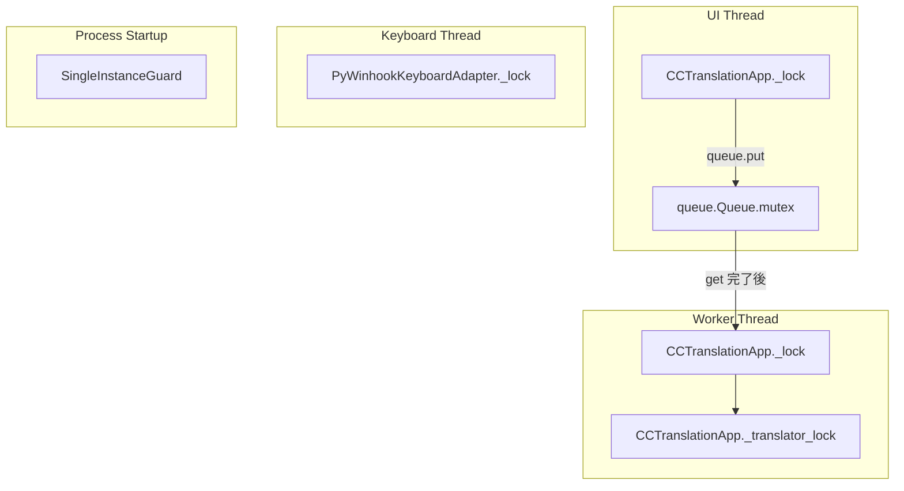

# ハング調査メモ

## 想定症状
- 起動後、翻訳ウィンドウ上の操作が応答しなくなる
- ホットキーのダブルコピーが効かなくなる

## 変更点
- `translator_app.py`: 翻訳ウィンドウの Tk `mainloop` をメインスレッドで実行するように変更 (commit 3fc1f648)

## 主な懸念点
1. `_process_single_request` が `_lock` を保持したままネットワーク越し翻訳 (`translate`) を待機し、UI スレッドのボタンハンドラ `_toggle_language` などが同じロックでブロックして UI が固まる恐れがある。
2. `CCTranslationApp.start` の再起動ループで `self._keyboard.unhook_all()` を呼ぶと、`PyWinhookKeyboardAdapter` のポンプスレッドが停止したまま再利用され、ホットキーが二度と発火せず「ハング」したように見える。
3. `_handle_copy_event` でも `_lock` を保持したまま `pyperclip.paste()` を呼び出しており、クリップボード API がハングすると UI 操作も巻き込まれる可能性がある。

## ロック/同期プリミティブの取得順序解析

### 主要プリミティブの整理

| 識別子 | 種別 | 定義箇所 | 主な利用箇所/役割 |
| --- | --- | --- | --- |
| `SingleInstanceGuard` | OS ファイルロック | `translator_app.py` L251-L309 | プロセス単位の二重起動防止。起動時にのみ取得し、その後は保持しない。|
| `CCTranslationApp._lock` | `threading.Lock` | `translator_app.py` L872-L917 | UI 言語状態や `_last_original_text` を保護。UI スレッド/ワーカー双方から取得。|
| `CCTranslationApp._translator_lock` | `threading.Lock` | `translator_app.py` L872-L930 | 翻訳クライアント生成/リセット時の排他。|
| `queue.Queue.mutex` | `threading.Lock` | `queue.Queue` 実装内部 | `_handle_copy_event` の `put`、ワーカーの `get` で暗黙的に取得。|
| `PyWinhookKeyboardAdapter._lock` | `threading.Lock` | `keyboard_adapter.py` L42-L189 | ホットキー登録/状態更新をシリアライズ。|

### 観測された取得順序

1. **起動フェーズ**: `SingleInstanceGuard` → (Tk 起動) → アプリ本体。ファイルロックは Tk/UI のロックとは独立し、循環待ちに寄与しない。 【F:translator_app.py†L251-L309】
2. **UI ハンドラ (`_toggle_language` / `_set_*`)**: UI スレッドが `CCTranslationApp._lock` を取得し、状態更新後に解放。キュー操作はロック解放後に実行されるため、`queue.Queue.mutex` とのネストは発生しない。 【F:translator_app.py†L982-L1015】
3. **コピーイベント**: `CCTranslationApp._lock` → (クリップボード I/O) → `queue.Queue.put`。無限キューのため `queue.Queue.mutex` で待機する場面は少ないが、ここで唯一 `_lock` とキューのミューテックスが同一スレッド内で連続取得される。 【F:translator_app.py†L1027-L1048】
4. **翻訳ワーカー**: `queue.Queue.get` (内部で `queue.Queue.mutex`) → `_process_single_request` 内で `CCTranslationApp._lock` → 翻訳クライアントを取得する際に `_translator_lock`。現状 `queue.Queue.mutex` は `get` の完了時点で解放されるため、`mutex` と `_lock` の同時保持は起きないが、順序としては `mutex` → `_lock` → `_translator_lock` の依存鎖になる。 【F:translator_app.py†L1050-L1069】
5. **ホットキー登録解除**: `PyWinhookKeyboardAdapter._lock` → `_stop_event` セット → `_pump_thread.join()`。アプリ側からこのロックを保持したまま `_handle_copy_event` を呼ぶ経路はなく、現在は単独利用。 【F:keyboard_adapter.py†L45-L189】

### 循環待ちグラフ



現状の実装では `queue.Queue.get()` が戻る時点で `mutex` が解放されるため、`B → C` の矢印は「論理的な依存順序」を示し循環待ちは発生していない。ただし、以下の条件が揃うと循環待ちが成立する余地がある:

- `_handle_copy_event` がバウンドキューでブロックした場合: UI スレッドが `A` を保持したまま `B` を待ち、ワーカースレッドが `B` を保持したまま新たに `A` を取得しようとすると `A ↔ B` の待ちが閉路になる。
- 何らかの変更で `_translator_lock` を保持した状態で `_lock` を取得する経路が追加された場合: `C ↔ D` の閉路が生じうる。

### 推奨される安全な取得順序

1. `SingleInstanceGuard` (プロセス全体で一度のみ)
2. `PyWinhookKeyboardAdapter._lock`
3. `CCTranslationApp._lock`
4. `queue.Queue.mutex`
5. `CCTranslationApp._translator_lock`

実装ガイドライン:

- UI スレッドからキュー操作を行う場合は `_lock` を解放してから `put` する（既存コードは条件付きで達成済みだがバウンドキュー導入時も堅牢性を維持する）。
- 翻訳クライアントのリセット/生成は `_translator_lock` のみで完結させ、アプリ状態ロックとの二重取得を避ける。
- もし複数ロックを連鎖取得する必要がある場合は上記の順序を遵守し、逆順取得を禁止する。

### ガードクラス提案

複数ロックの順序を強制するため、以下のようなラッパーを導入すると将来の改修での逆順取得を防ぎやすい:

```python
@contextlib.contextmanager
def acquire_app_locks(*, needs_queue: bool = False, needs_translator: bool = False):
    order = []
    # 1. PyWinhook 側は別スレッドなのでここでは扱わない
    order.append(self._lock)
    if needs_queue:
        order.append(self._request_queue.mutex)  # type: ignore[attr-defined]
    if needs_translator:
        order.append(self._translator_lock)

    acquired = []
    try:
        for lock in order:
            _timed_lock(lock, f"ordered:{lock}").__enter__()
            acquired.append(lock)
        yield
    finally:
        while acquired:
            lock = acquired.pop()
            lock.release()
```

実際の実装では `queue.Queue` の内部ロックを直接操作する代わりに、ロック対象を引数で受け取る薄い `Guard` クラス (`LockChainGuard`) として切り出し、`__enter__`/`__exit__` で `_timed_lock` を利用することで計測ログとの整合を確保できる。新たなハンドラが複数ロックを扱う際は、このガード経由に限定することで順序違反をコンパイル時（コードレビュー時）に検出しやすくなる。

